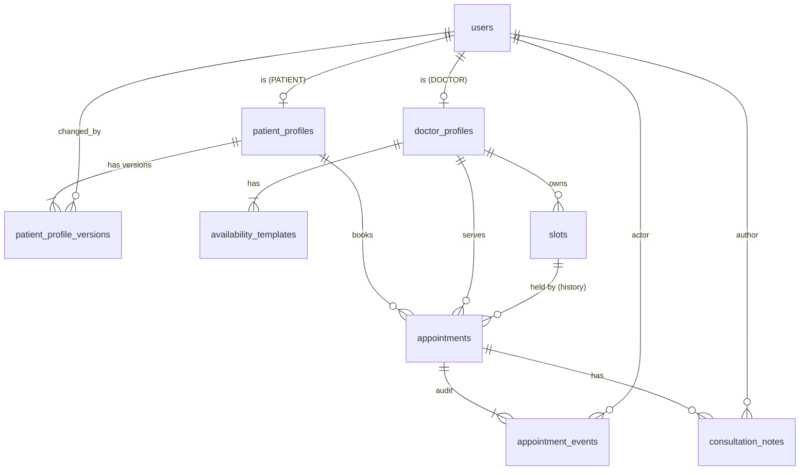

# TeleMed Data Models

Engine: SQLite 3 (WAL, `busy_timeout`, `foreign_keys=ON`) via SQLAlchemy 2 + Alembic. Machine-readable twin: `data-models.schema.json` (JSON Schema draft-07, row-level shapes; root validates a DB snapshot). Field names match `api-contracts.md`; the only intentional rename is money: API `fee` (string `"500.00"`) <-> column `fee_minor` (integer `50000`).

## 0. Conventions (and deliberate deviations from the generic architecture skill)

| Topic | Decision here | Generic skill says | Why we deviate |
|---|---|---|---|
| Primary keys | Integer `INTEGER PRIMARY KEY` (rowid alias), 1:1 profile tables keyed on `user_id` | UUIDs | The approved API contract fixes all ids as positive integers and `doctor_id == patient_id == user_id`. Ids are not secret: object access is checked by ownership (404), not obscurity. |
| Timestamps | `created_at` on every table; `updated_at` only on mutable tables (`users`, `doctor_profiles`, `slots`, `appointments`) | both on every table | Append-only tables can never be updated, so `updated_at` would be a lie. Set by the repository (explicit UTC), not by an ORM hook, so tests with a fixed clock are deterministic. |
| Deletes | No hard deletes anywhere in app code; users use `active` flag; append-only tables are trigger-protected | `deleted_at` soft delete | Deactivation is a business state (`active`), not deletion. `deleted_at` would add a second, unused flag. |
| Status fields | `TEXT` + `CHECK (col IN (...))`, mirrored by Python `StrEnum` | enums | SQLite has no enum type; CHECK is the DB-level enforcement (E1-S1 AC5). |
| Pagination | None (envelope `{items,total}`) | cursor | Prototype scale, fixed by the API contract. |
| Datetimes | UTC, stored as fixed-width text `YYYY-MM-DD HH:MM:SS.ffffff` through a `UtcDateTime` `TypeDecorator`; naive datetimes are rejected on bind. | timestamptz | SQLite has none; fixed width keeps lexical order == chronological order so range queries and indexes work. |
| Money | `INTEGER` minor units, `CHECK (>= 0)`. Domain uses `Decimal`; conversion only in `repository/mappers.py` (`Decimal('500.00') <-> 50000`). Currency is not stored (open question 2; single-currency assumption, label is a UI constant). | fixed-point | NFR-01. |
| Email | stored lower-cased, `CHECK (email = lower(email))`, `UNIQUE` | - | case-insensitive uniqueness (E1-S3 AC3). |

### 0.1 Deviation register (decision status)
These four deviations from the generic architecture skill were reviewed and are **ACCEPTED** (closed, not open questions). They stand until a later explicit decision changes them.

| # | Deviation | Status | Where recorded |
|---|---|---|---|
| 1 | Integer ids instead of UUIDs | **ACCEPTED** | Primary keys row above; `system-design.md` D12 |
| 2 | No soft delete (`deleted_at`); users use the `active` flag, append-only tables are trigger-protected | **ACCEPTED** | Deletes row above; D12 |
| 3 | Flat error body `{code, message, errors}` instead of the skill's nested `{error: {...}}` | **ACCEPTED** | `api-contracts.md` 0.4; D12 |
| 4 | Partial unique index `uq_appt_slot_live` on `appointments(slot_id) WHERE status <> 'CANCELLED'` (cancelled appointments keep the slot id as history) | **ACCEPTED** | section 2.7; `system-design.md` 3.1; D12 |

## 1. Entity relationship overview



Admins have a `users` row only (no profile). `full_name` in API `User` is derived: latest patient profile version, else `doctor_profiles.full_name`, else `null` (admins).

## 2. Tables

### 2.1 users
| Column | Type | Constraints | Notes |
|---|---|---|---|
| `user_id` | INTEGER | PK | API `user_id` |
| `email` | TEXT(254) | NOT NULL, UNIQUE, CHECK(email = lower(email)) | |
| `password_hash` | TEXT | NOT NULL, CHECK(password_hash LIKE '$argon2%') | never returned (E1-S3 AC5) |
| `role` | TEXT | NOT NULL, CHECK IN (PATIENT, DOCTOR, ADMIN) | authoritative role source (E1-S4) |
| `active` | INTEGER (bool) | NOT NULL DEFAULT 1, CHECK IN (0,1) | |
| `created_at`, `updated_at` | UtcDateTime | NOT NULL | |

Indexes: `uq_users_email` (unique), `ix_users_role_active (role, active)` for `GET /api/admin/users`.
Example: `{"user_id": 12, "email": "p1@example.test", "password_hash": "$argon2id$v=19$m=65536,t=3,p=4$...", "role": "PATIENT", "active": true, "created_at": "2026-10-05T10:00:00Z", "updated_at": "2026-10-05T10:00:00Z"}`

### 2.2 patient_profiles
| Column | Type | Constraints |
|---|---|---|
| `patient_id` | INTEGER | PK, FK users.user_id (role must be PATIENT; enforced in service) |
| `created_at` | UtcDateTime | NOT NULL |

Anchor row so `patient_profile_versions` has a typed FK target and so "id is not a patient" returns 404. Example: `{"patient_id": 12, "created_at": "2026-10-05T10:00:00Z"}`

### 2.3 patient_profile_versions (append-only)
| Column | Type | Constraints | API field |
|---|---|---|---|
| `version_id` | INTEGER | PK | - |
| `patient_id` | INTEGER | NOT NULL, FK patient_profiles | `patient_id` |
| `version_number` | INTEGER | NOT NULL, CHECK >= 1, UNIQUE(patient_id, version_number) | `version_number` |
| `full_name` | TEXT(200) | NOT NULL, CHECK(length(trim(full_name)) >= 1) | `full_name` |
| `age` | INTEGER | NOT NULL, CHECK(age > 0 AND age <= 130) | `age` |
| `gender` | TEXT | NOT NULL, CHECK IN ('FEMALE','MALE','OTHER','UNDISCLOSED') | `gender` |
| `phone` | TEXT(32) | NOT NULL, CHECK(length(trim(phone)) >= 1) | `phone` |
| `changed_by_user_id` | INTEGER | NOT NULL, FK users | - (patient or admin) |
| `created_at` | UtcDateTime | NOT NULL | API `updated_at` of the latest row |

Triggers: `trg_ppv_no_update` (BEFORE UPDATE) and `trg_ppv_no_delete` (BEFORE DELETE) `SELECT RAISE(ABORT, 'patient_profile_versions is append-only')`. Current profile = `ORDER BY version_number DESC LIMIT 1` (index `uq_ppv_patient_version` covers it). Version 1 is written at registration (AC-01) in the same transaction as the `users` and `patient_profiles` rows, so every patient always has a complete current profile. Editable only by the owning patient or an admin (service rule; `changed_by_user_id` records which). Partial updates copy forward omitted fields in the service inside `BEGIN IMMEDIATE`; the UNIQUE constraint is the backstop against a race.
Example: `{"version_id": 31, "patient_id": 12, "version_number": 2, "full_name": "Test Patient", "age": 36, "gender": "FEMALE", "phone": "+91-555-0100", "changed_by_user_id": 12, "created_at": "2026-10-06T08:00:00Z"}`

### 2.4 doctor_profiles
| Column | Type | Constraints |
|---|---|---|
| `doctor_id` | INTEGER | PK, FK users.user_id |
| `full_name` | TEXT(200) | NOT NULL (default = email local part, set by service) |
| `specialty` | TEXT(100) | NOT NULL, CHECK(length >= 1) |
| `languages` | TEXT (JSON array) | NOT NULL, CHECK(json_valid(languages) AND json_array_length(languages) BETWEEN 1 AND 10) |
| `fee_minor` | INTEGER | NOT NULL, CHECK >= 0 |
| `created_at`, `updated_at` | UtcDateTime | NOT NULL |

Languages are a JSON array (lower-cased, de-duplicated by service) rather than a child table so the schema keeps exactly the nine tables of E1-S1 AC1; language filter uses `EXISTS (SELECT 1 FROM json_each(languages) WHERE value = :lang)`. Indexes: `ix_doctor_specialty (lower(specialty))` (expression index) for the case-insensitive filter.
Example: `{"doctor_id": 7, "full_name": "Dr. Asha Rao", "specialty": "Cardiology", "languages": ["en","hi"], "fee_minor": 50000, "created_at": "2026-10-05T09:00:00Z", "updated_at": "2026-10-05T09:00:00Z"}`

### 2.5 availability_templates
| Column | Type | Constraints |
|---|---|---|
| `template_id` | INTEGER | PK |
| `doctor_id` | INTEGER | NOT NULL, FK doctor_profiles |
| `weekday` | INTEGER | NOT NULL, CHECK BETWEEN 0 AND 6 (0 = Monday) |
| `start_time`, `end_time` | TEXT `HH:MM` | NOT NULL, CHECK(end_time > start_time) |
| `slot_length_minutes` | INTEGER | NOT NULL, CHECK > 0 |
| `created_at` | UtcDateTime | NOT NULL |

Cross-row rules (rows of one weekday must not overlap; slot length divides the window) are validated in the service before insert and return 422. Index: `ix_templates_doctor_weekday (doctor_id, weekday)`. Templates are never edited by the API in this scope.
Example: `{"template_id": 1, "doctor_id": 7, "weekday": 0, "start_time": "09:00", "end_time": "12:00", "slot_length_minutes": 30, "created_at": "2026-10-05T09:00:00Z"}`

### 2.6 slots
| Column | Type | Constraints |
|---|---|---|
| `slot_id` | INTEGER | PK |
| `doctor_id` | INTEGER | NOT NULL, FK doctor_profiles |
| `start_time`, `end_time` | UtcDateTime | NOT NULL, CHECK(end_time > start_time) |
| `status` | TEXT | NOT NULL DEFAULT 'AVAILABLE', CHECK IN (AVAILABLE, BOOKED, BLOCKED) |
| `created_at`, `updated_at` | UtcDateTime | NOT NULL |

Constraints/indexes: `uq_slots_doctor_start UNIQUE (doctor_id, start_time)` (generator idempotency via `INSERT ... ON CONFLICT DO NOTHING`); `ix_slots_doctor_status_start (doctor_id, status, start_time)` (calendar, slot list, earliest-slot); `ix_slots_status_start (status, start_time)` (availability-range filter).
Only legal mutations are single conditional UPDATEs: book `AVAILABLE->BOOKED`, block `AVAILABLE->BLOCKED`, unblock `BLOCKED->AVAILABLE`, release on patient cancel/reschedule `BOOKED->AVAILABLE`, doctor cancel `BOOKED->BLOCKED`; each asserts `rowcount == 1`.
Example: `{"slot_id": 311, "doctor_id": 7, "start_time": "2026-10-12T03:30:00Z", "end_time": "2026-10-12T04:00:00Z", "status": "AVAILABLE", "created_at": "2026-10-05T09:00:00Z", "updated_at": "2026-10-05T09:00:00Z"}`

### 2.7 appointments
| Column | Type | Constraints |
|---|---|---|
| `appointment_id` | INTEGER | PK |
| `patient_id` | INTEGER | NOT NULL, FK patient_profiles |
| `doctor_id` | INTEGER | NOT NULL, FK doctor_profiles (denormalised from the slot for ownership checks without a join; never changes, reschedule is same-doctor only) |
| `slot_id` | INTEGER | NOT NULL, FK slots (current slot; repointed by reschedule) |
| `status` | TEXT | NOT NULL DEFAULT 'BOOKED', CHECK IN (BOOKED, CHECKED_IN, IN_PROGRESS, COMPLETED, CANCELLED, NO_SHOW) |
| `fee_minor` | INTEGER | NOT NULL, CHECK >= 0 (snapshot at booking) |
| `created_at`, `updated_at` | UtcDateTime | NOT NULL |

Indexes: `uq_appt_slot_live UNIQUE (slot_id) WHERE status <> 'CANCELLED'` (partial; a second safety net behind the conditional slot UPDATE: at most one non-cancelled appointment per slot; cancelled ones keep the slot id as history); `ix_appt_patient_status (patient_id, status)`; `ix_appt_doctor_status (doctor_id, status)` (deactivation check, queue); `ix_appt_slot (slot_id)`.
Example: `{"appointment_id": 42, "patient_id": 12, "doctor_id": 7, "slot_id": 311, "status": "BOOKED", "fee_minor": 50000, "created_at": "2026-10-05T10:00:00Z", "updated_at": "2026-10-05T10:00:00Z"}`
Derived (not stored): `start_time/end_time` (join slot), `change_deadline = start_time - 60 min`, `allowed_actions`, `join_url`.

### 2.8 appointment_events (append-only)
| Column | Type | Constraints |
|---|---|---|
| `event_id` | INTEGER | PK |
| `appointment_id` | INTEGER | NOT NULL, FK appointments |
| `event_type` | TEXT | NOT NULL, CHECK IN (BOOKED, CHECKED_IN, IN_PROGRESS, COMPLETED, CANCELLED, NO_SHOW, RESCHEDULED) |
| `from_status` | TEXT | NULL (null for the first BOOKED event), same status CHECK |
| `to_status` | TEXT | NOT NULL, same status CHECK (equals from_status for RESCHEDULED) |
| `actor_user_id` | INTEGER | NOT NULL, FK users |
| `actor_role` | TEXT | NOT NULL, CHECK IN (PATIENT, DOCTOR, ADMIN) |
| `old_slot_id`, `new_slot_id` | INTEGER | NULL, FK slots; both NOT NULL iff `event_type = 'RESCHEDULED'` (CHECK) |
| `created_at` | UtcDateTime | NOT NULL |

Triggers: `trg_ae_no_update`, `trg_ae_no_delete` (RAISE ABORT). Index: `ix_events_appt (appointment_id, event_id)`. Stubs (video/payment/prescription/notification) never insert here.
Example (reschedule): `{"event_id": 90, "appointment_id": 42, "event_type": "RESCHEDULED", "from_status": "BOOKED", "to_status": "BOOKED", "actor_user_id": 12, "actor_role": "PATIENT", "old_slot_id": 311, "new_slot_id": 315, "created_at": "2026-10-06T09:00:00Z"}`

### 2.9 consultation_notes (append-only)
| Column | Type | Constraints |
|---|---|---|
| `note_id` | INTEGER | PK |
| `appointment_id` | INTEGER | NOT NULL, FK appointments |
| `author_id` | INTEGER | NOT NULL, FK doctor_profiles (the appointment's doctor) |
| `text` | TEXT | NOT NULL, CHECK(length(trim(text)) >= 1 AND length(text) <= 5000) |
| `created_at` | UtcDateTime | NOT NULL |

Triggers: `trg_cn_no_update`, `trg_cn_no_delete`. Index: `ix_notes_appt (appointment_id, note_id)`. "Only after COMPLETED" is a service rule (a CHECK cannot read another table; a trigger could, but the service check plus 409 is sufficient and testable).
Example: `{"note_id": 5, "appointment_id": 42, "author_id": 7, "text": "Synthetic note: follow up in 2 weeks.", "created_at": "2026-10-12T04:20:00Z"}`

## 3. Trigger template
```sql
CREATE TRIGGER trg_cn_no_update BEFORE UPDATE ON consultation_notes
BEGIN SELECT RAISE(ABORT, 'consultation_notes is append-only'); END;
CREATE TRIGGER trg_cn_no_delete BEFORE DELETE ON consultation_notes
BEGIN SELECT RAISE(ABORT, 'consultation_notes is append-only'); END;
```
The same pair exists for the other two protected tables. Migration tests assert UPDATE and DELETE raise `IntegrityError`/`DatabaseError` and rows stay unchanged.

## 4. Connection pragmas (every connection, via SQLAlchemy `connect` event)
`PRAGMA journal_mode=WAL; PRAGMA busy_timeout=<BUSY_TIMEOUT_MS, default 10000, floor 5000>; PRAGMA foreign_keys=ON; PRAGMA synchronous=NORMAL;`. pysqlite is run with `isolation_level=None` and explicit `BEGIN IMMEDIATE` for write units of work so lock acquisition happens up front (no deferred-lock upgrade deadlocks, which is what would otherwise surface as 503 under the 20-way booking race).

## 5. Key invariants (each has a test)
1. A slot is `BOOKED` iff exactly one non-CANCELLED appointment points at it, except doctor-cancelled slots which are `BLOCKED` with a CANCELLED appointment.
2. Every appointment status change and reschedule inserts exactly one `appointment_events` row in the same transaction.
3. `fee_minor` snapshot on the appointment never changes after creation, even if the doctor fee changes.
4. `patient_profile_versions` version numbers per patient are contiguous from 1.
5. `slots.start_time` is always `now < start < now + 14d` at creation; rows are never deleted, past slots simply stop being listed.
