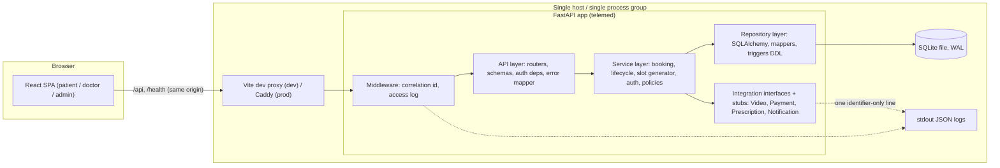
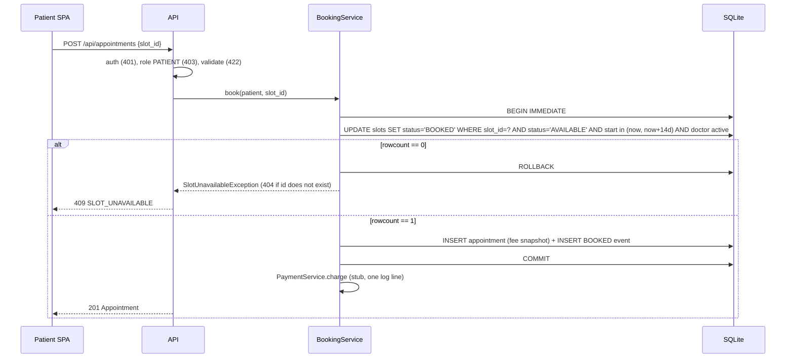

# TeleMed System Design

Confirmed from `specs/brd/brd.md` section 8: Python 3.12, FastAPI, SQLAlchemy 2, Alembic, Pydantic v2, SQLite (WAL, busy_timeout), argon2, JWT; React 18 + Vite + Tailwind + TypeScript; no Docker; ports 8000 (API) / 5173 (UI). Related: `api-contracts.md`, `data-models.md`, `folder-structure.md`, `deployment.md`.

## 1. Components

| Component | Responsibility | Notes |
|---|---|---|
| SPA | Role-specific screens, renders `allowed_actions` verbatim, handles 401/409/503 | token in `sessionStorage`; patient times in browser zone, staff in `provider_timezone` |
| API layer | Parse/validate, authenticate, authorise by role+ownership, map domain errors to `{code,message,errors}` | no business rules; imports Service and Types only, never Repository or Config (import-linter `forbidden` contract) |
| Service layer | All rules: state machine, 60-min window, atomic booking/reschedule, slot generation, deactivation safety | owns transaction boundaries through `unit_of_work` |
| Repository layer | SQL, conditional UPDATEs, minor-unit mapping, pragmas | the only place that touches SQLAlchemy |
| Integration stubs | Video join URL, charge/refund, e-prescription, notifications | interfaces in Service, injectable; never write to `appointment_events` |
| SQLite | single-file store, triggers make 3 tables append-only | WAL gives concurrent readers during a write |

## 2. Topology
- Dev: one machine. `npm start` runs `uvicorn telemed.api.app:create_app --factory --port 8000` and `vite --port 5173`; Vite proxies `/api` and `/health` so the browser is same-origin (no CORS).
- Prod (design only, see `deployment.md`): one host, Caddy terminates TLS and serves the built SPA, reverse-proxies `/api` and `/health` to one uvicorn process on loopback; SQLite file on a persistent volume.
- No queue, cache, worker or external service. Single writer process by design.

## 3. Key data flows

### 3.1 Atomic booking (AC-04/05, NFR-08)

Under 20 concurrent requests `BEGIN IMMEDIATE` serialises writers; `busy_timeout` (default 10 s, floor 5 s) is far larger than 20 sequential sub-millisecond transactions, so losers wait, then see rowcount 0 and return 409, never 503. A partial unique index on `appointments(slot_id) WHERE status <> 'CANCELLED'` is the second safety net.

### 3.2 Cancel / reschedule (AC-06/07)
Same shape: one `BEGIN IMMEDIATE` transaction that (a) loads the appointment under ownership checks (404), (b) evaluates the state/time rule using the injected clock (`start - now >= 60 min` inclusive, else `CHANGE_WINDOW_CLOSED`), (c) performs conditional slot UPDATEs (patient cancel: `BOOKED->AVAILABLE`; doctor cancel: `BOOKED->BLOCKED`; reschedule: claim target `AVAILABLE->BOOKED` and release old, repoint `slot_id`), (d) updates appointment status, (e) inserts exactly one event. Refund stub is called after commit exactly once. Any exception rolls the whole unit back (test injects a failure after the claim).

### 3.3 Lifecycle (AC-08)
`lifecycle_service.transition(appt, target, actor, now)` consults `types/state_machine.py` (BOOKED -> CHECKED_IN | CANCELLED | NO_SHOW; CHECKED_IN -> IN_PROGRESS | NO_SHOW; IN_PROGRESS -> COMPLETED), applies the NO_SHOW-after-start guard, writes status + one event in one transaction. `allowed_actions` is produced by the same module for the caller's role and clock, so the SPA never re-implements rules.

### 3.4 Slot generation (AC-03, E2-S1)
`slot_generator.generate(now)`: for each active doctor and template row, for each date in the next 14 days in `PROVIDER_TIMEZONE`, build local start datetimes (zone-aware, DST-gap times skipped, ambiguous times use first occurrence), convert to UTC, keep `now < start < now+14d`, `INSERT ... ON CONFLICT(doctor_id,start_time) DO NOTHING`. Called **only** at onboarding (inside the onboarding transaction), by the seed script and in the FastAPI lifespan on startup (catch-up after downtime), per the BRD; there is no scheduler, cron or systemd timer. Idempotent by the unique constraint.

### 3.5 Auth (NFR-04)
Login: look up lower-cased email, always run an argon2 verify (against a dummy hash if user unknown or inactive) so timing and body are identical; issue HS256 JWT (`sub`, `iat`, `exp`, `jti`, `role` informational). Every protected request: decode, load user, reject inactive (401), take role from DB, check route role (403), then ownership (404), then input (422), then state (409).

**Admin access (authoritative matrix: `api-contracts.md` section 0.2.1).** ADMIN may: GET any id-addressed resource (patient profiles, appointments, notes, doctors/slots); edit patient profiles (AC-01, `PUT /api/admin/patients/{patient_id}/profile`, recorded as `changed_by_user_id`); list, deactivate and reactivate users; onboard doctors. ADMIN may not: book, cancel, reschedule, change status or add notes on behalf of others (403 `FORBIDDEN`), and gets 403 on role-specific `/me` routes (`/api/patients/me/*`, `/api/doctors/me/*`, `/api/appointments/mine`). Admin views of appointments are read-only (`allowed_actions = []`, `join_url = null`). Patient profiles are editable only by the owning patient or an admin; doctors and other patients are refused. These rules live in `service/access.py` and are applied by the Service layer; the API layer only passes the authenticated role through.

### 3.6 Logging (NFR-03/06)
JSON formatter emits `timestamp, level, event, correlation_id` plus whitelisted identifier fields (`user_id`, `appointment_id`, `version_number`, `event_type`, `status_code`, `path_template`). Request/response bodies are never logged; a logging filter drops any record carrying a non-whitelisted `extra` key. Exception mapping logs the exception class, not its message. A test posts email/name/note text and greps captured logs.

### 3.7 Error mapping
Domain exceptions (`types/errors.py`) carry a stable `code`; `api/errors.py` maps them to status and the flat `{code,message[,errors]}` body. SQLite `OperationalError: database is locked` -> 503 `SERVICE_UNAVAILABLE`; unhandled -> 500 generic; Starlette 405 -> `METHOD_NOT_ALLOWED` with `Allow`.

## 4. Key decisions

| # | Decision | Rationale | Alternatives considered |
|---|---|---|---|
| D1 | Layered modular monolith, import-linter enforced (layers contract plus a `forbidden` contract: API imports only Service and Types, never Repository) | Smallest thing satisfying the rubric; one deployable; rules checkable by tests | Microservices (needless network and ops cost); hexagonal with full DI container (more ceremony than 6 aggregates justify) |
| D2 | SQLite WAL + `BEGIN IMMEDIATE` | Zero infrastructure, `npm start` without Docker, fast `/health`; correctness comes from one conditional UPDATE | PostgreSQL row locks (BRD option B, rejected: Docker, startup cost); SQLite with deferred transactions (lock-upgrade failures surface as 503) |
| D3 | State on the appointment row + append-only event log beside it | Simple reads for queue/search; audit satisfies NFR-02 | Full event sourcing (BRD option C, rejected: projections, schedule risk) |
| D4 | Append-only enforced twice: no update/delete code path AND SQLite triggers | NFR-02/08: even a buggy or hand-written SQL cannot mutate history | App-level only (bypassable); revoking privileges (SQLite has none) |
| D5 | Money = integer minor units in DB, `Decimal` in domain, string in API, conversion only in `repository/mappers.py` | NFR-01, no float anywhere, single audited conversion point | `NUMERIC` column (SQLite stores it as float/affinity, unsafe); string column (cannot CHECK >= 0 or sum) |
| D6 | UTC storage, fixed-width text datetimes via TypeDecorator; provider zone only at the edges (template expansion, queue day, labels) | Correct ordering and indexing; DST handled in one place | Epoch integers (unreadable in debugging); local-time storage (ambiguity) |
| D7 | Role read from DB per request; JWT claim informational | Deactivation and role change take effect immediately (E1-S4) | Trusting claims (stale for up to 30 min); server-side session store (state, no need) |
| D8 | Access order 401 -> 403 -> 404 -> 422 -> 409, 404 for other users' objects | No object-existence leak between patients | 403 for foreign objects (leaks existence) |
| D9 | `allowed_actions` and `change_deadline` computed server-side | One implementation of the state machine and the 60-min rule | Duplicating rules in the SPA (drift) |
| D10 | Stubs behind Service-layer protocols, injected through FastAPI dependencies | Spy-able in tests (refund exactly once), swap-in later without touching callers | Direct function calls (untestable); real SDKs (out of scope) |
| D11 | Slot generation on a lazy 14-day rolling window at onboarding, seed and startup, no cron or timer (BRD) | No scheduler to run; catches up after downtime; idempotent | Background scheduler (extra process, drift); generate on read (writes in GET) |
| D12 | **ACCEPTED** deviations: integer ids, no soft delete, flat `{code,message,errors}` error body, partial unique index `appointments(slot_id) WHERE status <> 'CANCELLED'`; also no pagination, no version prefix | Fixed by approved API contract; supersedes the generic skill defaults (UUID, `deleted_at`, nested error, cursor). Status: accepted, not open | See `data-models.md` sections 0 and 0.1 |
| D13 | Single uvicorn process (workers = 1) in the default deployment | SQLite single-writer; keeps startup slot generation single-flight | Multiple workers (works with WAL, but generation races are only de-duplicated by the unique constraint) |

## 5. Quality attributes and how they are met
- Consistency: conditional UPDATE + unique indexes + one transaction per mutation.
- Security: argon2id, short JWT, generic login failure, server-side authorisation on every route, no PHI in logs, bodies never echoed in errors, secrets from env only.
- Performance: `/health` does no heavy work and the app starts without migrations running (migrations are a separate pre-start step; startup only verifies the schema head). Slot catch-up runs after the server is accepting connections (lifespan background task) so it cannot delay `/health` past 1 s.
- Observability: JSON logs with correlation ids; `X-Request-ID` echoed.
- Testability: injectable clock (`config/clock.py`), stub spies, tmp-file SQLite per test.

## 6. Risks
| Risk | Mitigation |
|---|---|
| SQLite lock contention -> 503 | `BEGIN IMMEDIATE`, 10 s busy timeout, short transactions, argon2 hashing outside transactions, concurrency test asserts zero 503 |
| Stale slots after downtime | startup catch-up generation |
| Window shrinks while one process stays up for days (no timer by decision) | restart/deploy re-runs startup generation; onboarding also generates; accepted for prototype scale |
| Template misconfiguration | 422 at onboarding with field paths |
| DST edge cases in expansion | zone-aware expansion with unit tests for gap/overlap dates |
| Registration profile gap (age/gender vs contract) | resolved: contract, schemas and mockups carry full_name, age, gender, phone (AC-01) |
