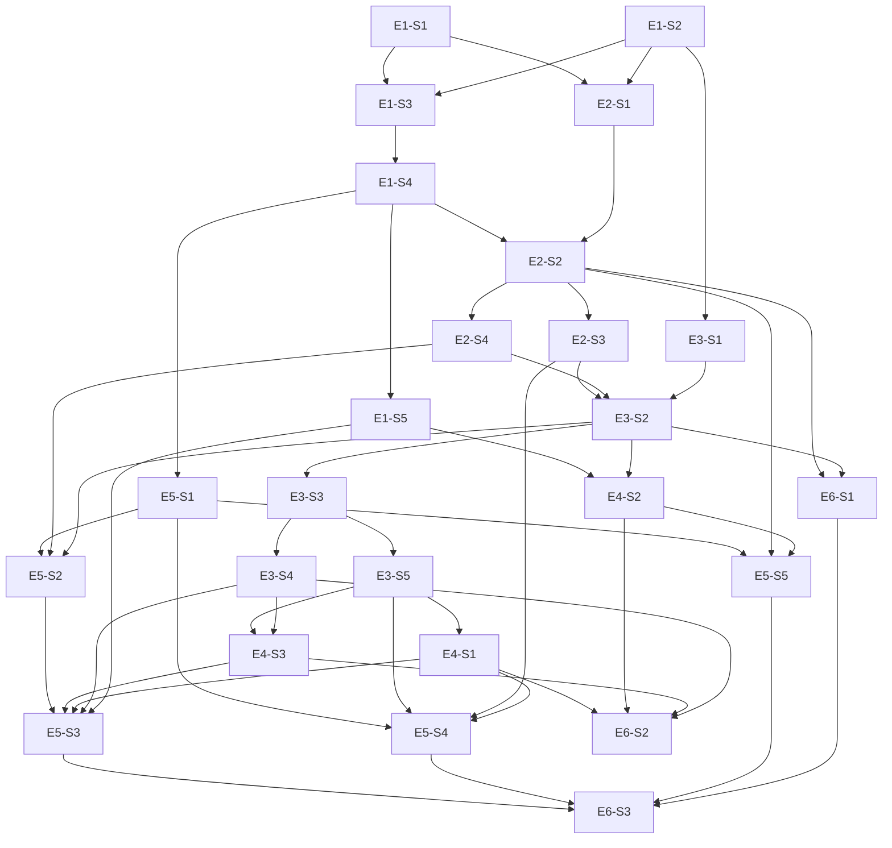

# Dependency Graph

Groups are computed from the longest dependency chain. Stories in one group are independently executable in parallel. No cycles (validated at generation).

## Group A

| Story ID | Title | Layer | Dependencies |
|---|---|---|---|
| E1-S1 | Domain types, schema and append-only protections exist | Repository | - |
| E1-S2 | Platform skeleton with health, logging and error mapping | Config | - |

## Group B

| Story ID | Title | Layer | Dependencies |
|---|---|---|---|
| E1-S3 | Patient can register and log in | API | E1-S1, E1-S2 |
| E2-S1 | Slots are generated idempotently from availability templates | Service | E1-S1, E1-S2 |
| E3-S1 | Stub integrations sit behind injectable interfaces | Service | E1-S2 |

## Group C

| Story ID | Title | Layer | Dependencies |
|---|---|---|---|
| E1-S4 | Server-side authentication and role separation on every route | API | E1-S3 |

## Group D

| Story ID | Title | Layer | Dependencies |
|---|---|---|---|
| E1-S5 | Patient can view and update a versioned profile | API | E1-S4 |
| E2-S2 | Admin can onboard a doctor with an availability template | API | E1-S4, E2-S1 |
| E5-S1 | Frontend shell with auth screens, session and route guards | UI | E1-S4 |

## Group E

| Story ID | Title | Layer | Dependencies |
|---|---|---|---|
| E2-S3 | Doctor can view, block and unblock their own slots | API | E2-S2 |
| E2-S4 | Patient can search doctors and view open slots | API | E2-S2 |

## Group F

| Story ID | Title | Layer | Dependencies |
|---|---|---|---|
| E3-S2 | Patient can book an appointment atomically | API | E2-S3, E2-S4, E3-S1 |

## Group G

| Story ID | Title | Layer | Dependencies |
|---|---|---|---|
| E3-S3 | Patient or doctor can cancel an appointment | API | E3-S2 |
| E4-S2 | Admin can list, deactivate and reactivate users and edit patient profiles | API | E1-S5, E3-S2 |
| E5-S2 | Patient UI for doctor search, slot picking and booking | UI | E5-S1, E2-S4, E3-S2 |
| E6-S1 | Seed script creates synthetic demo data | Service | E2-S2, E3-S2 |

## Group H

| Story ID | Title | Layer | Dependencies |
|---|---|---|---|
| E3-S4 | Patient can reschedule an appointment atomically | API | E3-S3 |
| E3-S5 | Doctor can drive the appointment lifecycle and see a daily queue | API | E3-S3 |
| E5-S5 | Admin UI for doctor onboarding and user management | UI | E5-S1, E2-S2, E4-S2 |

## Group I

| Story ID | Title | Layer | Dependencies |
|---|---|---|---|
| E4-S1 | Doctor can append consultation notes that patients can read | API | E3-S5 |
| E4-S3 | Patient can list and open their own appointments | API | E3-S5, E3-S4 |

## Group J

| Story ID | Title | Layer | Dependencies |
|---|---|---|---|
| E5-S3 | Patient UI for my appointments, notes and profile | UI | E5-S2, E4-S3, E4-S1, E3-S4, E1-S5 |
| E5-S4 | Doctor UI for daily queue, slot calendar and notes | UI | E5-S1, E3-S5, E2-S3, E4-S1 |
| E6-S2 | Quality gates enforce coverage, layering and AC traceability | Config | E4-S1, E4-S2, E4-S3, E3-S4 |

## Group K

| Story ID | Title | Layer | Dependencies |
|---|---|---|---|
| E6-S3 | End-to-end and component tests cover the main flows at both viewports | UI | E5-S3, E5-S4, E5-S5, E6-S1 |

## Diagram

